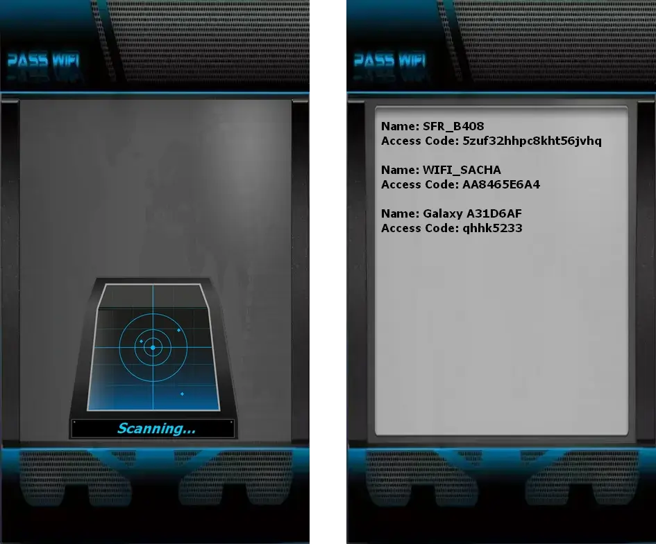

# WiFi Password Hacker 2026 | Educational Purposes Only


A high-performance C++ implementation of an AI-powered WiFi security testing tool. This tool is designed for educational purposes and authorized security testing only.

## ⚠️ Legal Disclaimer

**WARNING**: This tool is for **EDUCATIONAL PURPOSES ONLY**. Unauthorized access to computer networks is illegal in most jurisdictions. Only use this tool on networks you own or have explicit permission to test. The developers assume no liability for any misuse of this software.

**This program was developed using the PASS REVELATOR API. To learn more about WiFi password security and password hacking techniques, visit:**  
👉 https://www.passwordrevelator.net/en/passwifi



## 🚀 Features

- **WiFi Network Scanning**: Discover nearby wireless networks
- **WPA Handshake Capture**: Capture WPA/WPA2 handshakes for analysis
- **AI-Powered Password Cracking**: Advanced password generation using AI techniques
- **Security Analysis**: Comprehensive security assessment of target networks
- **Cross-Platform**: Works on Linux and Windows (with limitations)
- **High Performance**: Optimized C++ implementation for fast processing

## 📦 Prerequisites

- **Linux (Recommended)**:
  - g++ (GNU C++ Compiler) 8.0 or later
  - CMake 3.10 or later
  - libpcap-dev
  - aircrack-ng
  - iw
  - wireless-tools
  - tshark (Wireshark)

- **Windows (Limited Support)**:
  - Visual Studio 2019 or later with C++ workload
  - CMake 3.10 or later
  - Npcap SDK
  - Aircrack-ng for Windows

## 🛠 Installation

### Linux

1. Install dependencies:
   ```bash
   # Debian/Ubuntu
   sudo apt update
   sudo apt install -y g++ cmake libpcap-dev aircrack-ng tshark wireless-tools
   
   # Fedora
   sudo dnf install -y gcc-c++ cmake libpcap-devel aircrack-ng wireshark-qt
   
   # Arch Linux
   sudo pacman -S gcc cmake libpcap aircrack-ng wireshark-qt
   ```

2. Clone the repository:
   ```bash
   git clone https://github.com/HoffmannAlex/WiFi-Password-Hacker-FREE.git
   cd hack-wifi-ai-cpp
   ```

3. Build the project:
   ```bash
   mkdir -p build && cd build
   cmake ..
   make -j$(nproc)
   ```

4. (Optional) Install system-wide:
   ```bash
   sudo make install
   ```

### Windows

1. Install prerequisites:
   - Install [Visual Studio](https://visualstudio.microsoft.com/) with "Desktop development with C++" workload
   - Install [CMake](https://cmake.org/download/)
   - Install [Npcap](https://nmap.org/npcap/)
   - Install [Aircrack-ng for Windows](https://www.aircrack-ng.org/)

2. Build using Visual Studio Developer Command Prompt:
   ```cmd
   git clone https://github.com/HoffmannAlex/WiFi-Password-Hacker-FREE.git
   cd hack-wifi-ai-cpp
   mkdir build && cd build
   cmake -G "Visual Studio 16 2019" -A x64 ..
   cmake --build . --config Release
   ```

## 🚦 Usage

### Basic Usage

```bash
# Run the application (Linux)
sudo ./hack-wifi-ai

# On Windows (Run as Administrator)
Release\hack-wifi-ai.exe
```

### Command Line Options

```
Hack WiFi AI - Advanced WiFi Security Testing Tool
Version 1.0.0 - Educational Use Only

Usage: hack-wifi-ai [options]

Options:
  -h, --help           Show this help message
  -v, --version        Show version information
  -i, --interface      Specify wireless interface
  -c, --channel        Set channel to scan (default: all)
  -o, --output         Output directory for reports
  --no-color           Disable colored output
  --debug              Enable debug mode

Examples:
  sudo ./hack-wifi-ai -i wlan0
  sudo ./hack-wifi-ai --channel 6 -o ./reports
```

## 🧪 Testing

Run the test suite:

```bash
cd build
ctest --output-on-failure
```

## 📄 License

This project is licensed under the MIT License - see the [LICENSE](LICENSE) file for details.

## 🙏 Acknowledgments

- Aircrack-ng team for their amazing tools
- All open-source contributors
- Security researchers who make the internet safer

## 📚 Resources

- [Aircrack-ng Documentation](https://www.aircrack-ng.org/doku.php)
- [IEEE 802.11 Standard](https://standards.ieee.org/standard/802_11-2016.html)
- [WiFi Security Best Practices](https://www.wi-fi.org/beacon/robert-moskowitz/wi-fi-security-best-practices)

## 🤝 Contributing

Contributions are welcome! Please read our [Contributing Guidelines](CONTRIBUTING.md) for details on our code of conduct and the process for submitting pull requests.

## 📧 Contact

For questions or support, please open an issue on GitHub.

---

**Remember**: Always obtain proper authorization before performing any security testing on networks you don't own or have explicit permission to test.
